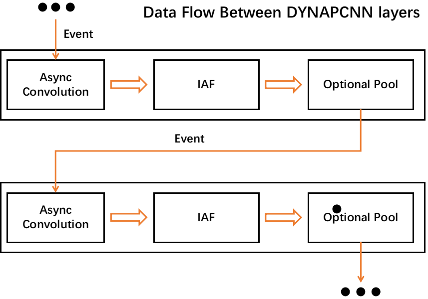

# FAQs

## 1. What network structure can I define?
A: sinabs and sinabs-dynapcnn now only accepts auto converts the *nn.Sequential* structure. The skip and recurrent structure between DYNAPCNN layers are also support now by manually configuration.

## 2. What kinds of neural network operation I can use in Speck/DYNAP-CNN?
A: Currently we only support Conv2d, Avgpool, Sumpool, Linear, Flatten, as well as the IAF activation

## 3. What execution order should I notice when I am implementing a sequential structure?
A: You should be aware with the internal layer order. DYNAP-CNN techonology defines serveral layers that can be communicates each other. In a layer, the Convolution and Neuron activation must be implemented with **Conv-->IAF order-->pool(optional)** order. The cascaded convolution and neuron activation in a DYNAPCNN layer is not allowed.



### Ex1. Bad Case: Cascaded convlution
```

network = nn.sequential([
                        nn.conv2d(),
                        nn.conv2d(),
                        IAFsqueeze(),
                        ])
                    
```
### Ex2. Bad Case: None sequential
```

class Network:
    
    def __init__(self):
        self.conv1 = nn.conv2d()
        self.iaf = IAFsqueeze()
    def forward(self, x):
        out = self.conv1(x)
        out = self.iaf(out)
        return out
                    
```

### Ex3. Bad Case: Use unsupport operation

```
network = nn.sequential([
                        nn.conv2d(),
                        nn.BatchNorm2d(), # unspport in speck/dynapcnn
                        IAFsqueeze(),
                        ])
```

### Ex3. Good Case: Use unsupport operation

```
network = nn.sequential([
                        nn.conv2d(),
                        IAFsqueeze(),
                        nn.pool(),
                        # up to here is using 1 dynapcnn layer
                        nn.conv2d(),
                        IAFsqueeze(),
                        nn.Flatten(),
                        nn.Linear(),
                        IAFsqueeze(),
                        # up to here is using 2 dynapcnn layer
                        ])
```


## 4. What is the limination for network sizing?
A: we introduced the neuron memory and kernel memory constraints in the design. Apart from these:
* maximumlly using **9** dynapcnn layer
* convolution channel number < **1024**
* convolution kernel size < **16**
* pool size = [1, 2, 4, 8]
* if you are using readout layer, the number of output class should< **15**

## 5. Known dev-kit bugs

* Channel index mapping error between the output DYNAP-CNN layer and readout block(on Speck2e/2f), for details see [here](https://synsense.gitlab.io/sinabs-dynapcnn/notebooks/using_readout_layer.html)


## 6. How to use the leak-neuron
